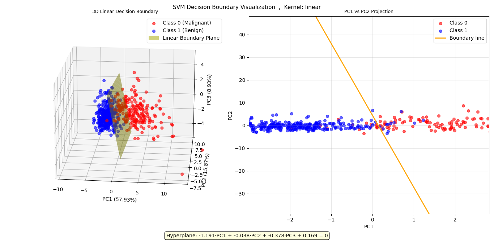
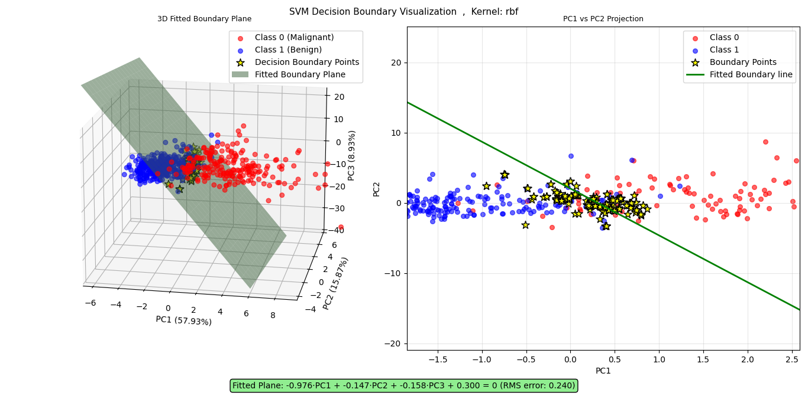

# SVM Decision Boundary Visualization in High-Dimensional Space

This project demonstrates advanced techniques for visualizing SVM decision boundaries in high-dimensional datasets by reducing them to 3D space. The implementation handles both **linear** and **non-linear** kernels using different mathematical approaches.

## 🎯 Project Overview

The main challenge in machine learning visualization is representing high-dimensional decision boundaries in a way humans can understand. This project solves this problem by:

1. **Linear Kernels**: Using analytical transformation of hyperplane coefficients
2. **Non-linear Kernels**: Using optimization-based boundary point detection followed by plane fitting

## 📊 Dataset

- **Dataset**: Breast Cancer Wisconsin Dataset (30 features)
- **Classes**: Malignant (0) and Benign (1)
- **Samples**: 569 instances
- **Preprocessing**: StandardScaler normalization and RFECV feature selection

## 🔧 Key Features

- **Unified Visualization System**: Handles both linear and non-linear kernels automatically
- **Dimensionality Reduction**: PCA to reduce from high-D to 3D visualization
- **Feature Selection**: RFECV with permutation importance for non-linear kernels
- **Hyperparameter Tuning**: GridSearchCV for optimal SVM parameters
- **Interactive 3D Plotting**: Both 3D surface and 2D projection views

## 🧮 Mathematical Approaches

### Linear Kernel Decision Boundary Transformation

For linear SVM kernels, the decision boundary is a hyperplane defined by:
```
w₁x₁ + w₂x₂ + ... + wₙxₙ + b = 0
```

**Our analytical approach:**

1. **Extract hyperplane coefficients** from the trained SVM:
   ```python
   w_high_dim = classifier.coef_[0]  # Normal vector in high-D space
   b_high_dim = classifier.intercept_[0]  # Bias term
   ```

2. **Transform to 3D PCA space** using the mathematical relationship:
   ```python
   w_3d = w_high_dim @ pca_components.T
   ```
   This transforms the high-dimensional normal vector to 3D space by multiplying with PCA components.

3. **Adjust bias term** for PCA mean centering:
   ```python
   mean_contribution = np.dot(w_high_dim, pca_mean)
   b_3d = mean_contribution + b_high_dim
   ```

4. **Generate 3D plane mesh** using the equation:
   ```
   w₃ᴅ[0]·PC1 + w₃ᴅ[1]·PC2 + w₃ᴅ[2]·PC3 + b₃ᴅ = 0
   ```

### Non-linear Kernel Decision Boundary Approximation

For non-linear kernels (RBF, Polynomial), the decision boundary is a complex surface that cannot be analytically transformed. Our optimization-based approach:

1. **Boundary Point Detection**: Find points where `P(class=1) ≈ 0.5` using optimization:
   ```python
   def objective(t):
       point = p1 + t[0] * (p2 - p1)
       prob = classifier.predict_proba(point.reshape(1, -1))[0][1]
       return abs(prob - 0.5)  # Minimize distance from decision boundary
   ```

2. **Two-stage strategy**:
   - **Stage 1**: Find boundaries between random pairs of different classes
   - **Stage 2**: Refine by exploring around existing boundary points

3. **3D Plane Fitting**: Use SVD to fit the best plane through boundary points:
   ```python
   # Center the boundary points
   centered_points = boundary_points - centroid
   
   # SVD decomposition
   U, s, Vt = np.linalg.svd(centered_points)
   
   # Normal vector is the last row of Vt (smallest singular value)
   normal = Vt[-1, :] / np.linalg.norm(Vt[-1, :])
   ```

4. **Plane equation**: `normal[0]·PC1 + normal[1]·PC2 + normal[2]·PC3 + d = 0`

## 🖼️ Visualization Results

### Linear Kernel Results


The linear kernel produces a clean hyperplane that can be analytically transformed to 3D space. The decision boundary is a perfect plane that separates the two classes.

### RBF Kernel Results


The RBF kernel creates a complex non-linear decision surface. Our optimization approach finds boundary points and fits an approximating plane, showing the general orientation of the decision region.

## 🚀 Installation and Usage

### Prerequisites
```bash
pip install numpy matplotlib scikit-learn scipy
```

### Running the Code
```bash
python svm_boundary_visualization.py
```

### Key Parameters
- `acceptance_threshold=0.05`: Tolerance for boundary point detection
- `n_boundary_points=200`: Number of boundary points to find for non-linear kernels
- `max_iterations=500`: Maximum optimization iterations per boundary point

## 🏗️ Code Structure

### Main Classes

#### `HighDimDecisionBoundaryViz`
The core visualization class that automatically detects kernel type and applies the appropriate method:

- **Linear Kernels**: `_transform_linear_hyperplane_to_3d()`
- **Non-linear Kernels**: `_find_boundary_points()` + `_fit_plane_to_boundary_points()`

### Key Methods

1. **`fit(X, y)`**: Fits the visualization system and applies the appropriate boundary detection method
2. **`plot_3d()`**: Creates 3D visualization with data points, boundary plane, and 2D projections
3. **`_generate_plane_mesh()`**: Generates mesh coordinates for 3D plane visualization

## 📈 Performance Metrics

The implementation includes comprehensive evaluation:
- **Hyperparameter Tuning**: GridSearchCV with cross-validation
- **Feature Selection**: RFECV with permutation importance
- **Model Evaluation**: Accuracy, F1-score
- **Visualization Quality**: RMS fitting error for non-linear boundaries

## 🔍 Technical Highlights

### Dimensionality Reduction Mathematics

**PCA Transformation**: For a point x in high-dimensional space, its 3D representation is:
```
x_3d = (x - μ) · V^T
```
where μ is the mean and V contains the first 3 principal components.

**Hyperplane Transformation**: The linear decision boundary normal vector transforms as:
```
w_3d = w_high_dim · V^T
```

### Optimization Strategy

For non-linear kernels, we solve:
```
minimize |P(y=1|x) - 0.5|
subject to: x lies on line between different class points
```

This finds points where the classifier is most uncertain, indicating the decision boundary location.

## 🎓 Educational Value

This project demonstrates:
- **Linear Algebra**: Matrix transformations and hyperplane mathematics
- **Optimization**: Constrained optimization for boundary detection
- **Machine Learning**: SVM theory and kernel methods
- **Visualization**: 3D plotting and dimensionality reduction
- **Software Engineering**: Object-oriented design and unified interfaces

## 🔧 Customization

The `HighDimDecisionBoundaryViz` class can be easily adapted for other datasets and classifiers that support `predict_proba()`. Key parameters can be tuned based on dataset complexity and computational resources.

## 📊 Results Summary

- **Linear Kernel**: Exact analytical transformation with perfect plane representation
- **Non-linear Kernels**: Approximation using optimization with typical RMS errors < 0.05
- **3D Visualization**: Intuitive understanding of high-dimensional decision boundaries
- **Feature Selection**: Automatic selection of most informative features

## 🤝 Contributing

Feel free to contribute by:
- Adding support for other kernel types
- Improving optimization algorithms
- Enhancing visualization features
- Adding more datasets

## 📄 License

This project is open source and available under the MIT License.
